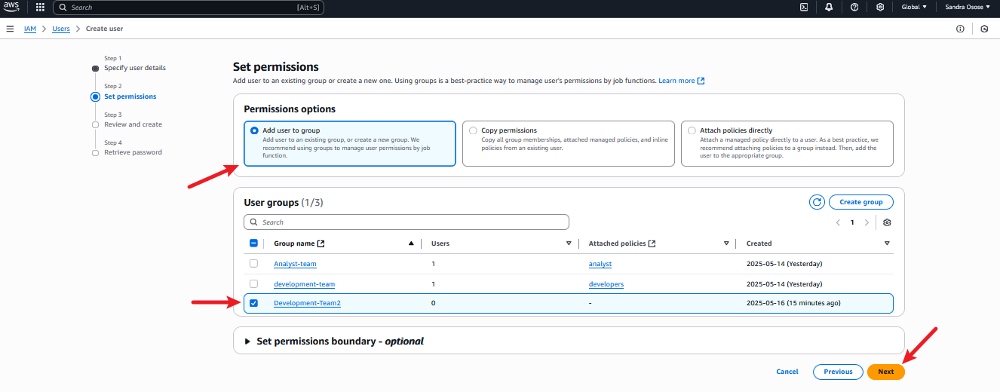

# AWS Identity and Access Management 2

### What is IAM?
IAM or Identity and Access Management to me , it is like a gatekeeper for your AWS resources, its job is to decide who gets in and what they are allowed to do once they are in.

IAM helps keeps your AWS resources safe and sound, making sure only the right people gets in and they are only allowed to do what you say they can.

`Note` AWS ressources are the various services and toold provided by Amazon Web Server (AWS) that users can utilize to build and manage their applications and infrasturctures in the cloud.

### What is IAM User?

`IAM users` are like individual accounts for different people or entities within your AWS environment.

For example, if you have a team working on a project, you can create separate IAM users for each team member. Each IAM user would have their own unique username and password, allowing them to access the AWS resources they need for their work.

IAM users help you manage and control access to your AWS resources securely, ensuring that each user only has access to the resources they need to perform their tasks.

### What is IAM Role?

An IAM role defines what someone or something (like an application or service) can do within your AWS account. Each role has a set of permissions that determine which actions it can perform and which AWS resources it can access.

For example, you might have an "admin" role that gives full access to all resources, or a "developer" role that only allows access to certain services for building applications.

Or if we take another example, imagine you have a visitor who needs temporary access to your house to fix something. Instead of giving them a permanent key (IAM user), you give them a temporary key (IAM role) that only works for a limited time and grants access to specific rooms (AWS resources).

IAM roles are flexible and can be assumed by users, services, or applications as needed. They are commonly used for tasks such as granting permissions to AWS services, allowing cross-account access, or providing temporary access to external users. IAM roles enhance security and efficiency by providing controlled access to AWS resources without the need for permanent credentials.

### What is IAM Policy?

An IAM policy is a set of rules that define what actions a role can take. These rules specify the permissions granted to the role. Think of a policy as a rulebook for the role. It outlines which actions are allowed and which are not, helping to ensure secure and controlled access to your AWS resources.

`IAM policies` define the permissions granted to `IAM roles and users`, specifying which AWS resources they can access and what actions they can take. They are essential for maintaining security and controlling access to AWS resources, ensuring that only authorized actions are performed by users and roles within your AWS account.

### What is IAM group?

`IAM Groups` are like collections of IAM users. Instead of managing permissions for each user individually, you can organize users into groups based on their roles or responsibilities.

You can think IAM Groups as these neat little collections of users with similar roles or responsibilities. It's like putting everyone into teams based on their tasks.

For example, let's say you have a development team working on a project. Instead of assigning permissions to each developer one by one, you can create an IAM Group called "Developers and add all the developers to that group. Then, you assign permissions to the group as a whole. So, if you want all developers to have access to the same resources, you only need to set it up once for the group.

### Best Practices:

- Give only the permissions needed: Don't give more access than necessary.

- Use roles instead of users: Roles are safer and can be used when needed.

- Review roles regularly: Remove unused roles to keep things tidy and secure.

- Add extra security with MFA: Use Multi-Factor Authentication for extra protection.

- Use ready-made policies. They're safer and easier to use.

- Keep policies simple: Make separate policies for different tasks

- Keep track of changes: Keep a record of who changes what

- Test policies before using them: Make sure they work the way you want them to before applying them to real stuff.

- Use descriptive names: Choose clear and descriptive names for IAM Groups to faciliate understanding and management.

- Enforce strong password policy: Encourage user to create strong password and implement expiration and complexity requirements.

`Note`- (difference between users and roles) In AWS, users are like individual people with their own set of keys to access resources. These keys are permanent and tied to specific individuals. It's similar to having your own key to the front door of your house-it's always yours.

On the other hand, roles in AWS are more like special keys that can be used by different people or even programs. These keys provide temporary access and can be used by different users as needed. Roles are like master keys that can be used by anyone who needs access to certain things temporarily. So, while users are tied to specific individuals, roles are more flexible and can be shared among different users for specific tasks.

For MFA you can check [Multi-Factor Authentication (MFA) for IAM](https://aws.amazon.com/iam/features/mfa/)

## PRACTICAL EXAMPLE:

A growth marketing consultancy company called GatoGrowFast.com wants to give some access to their employee Eric, Jack and Ade to the Aws resources. Let's see how it is being setup.

I will do it in Two parts. In the first part of the practical, I will create a policy granting full access to EC2. Then, I will create a user named Eric and attach that policy to him.

In the second part, I will create a group and add two more users, Jack and Ade, to that group. Afterward, I will create a policy for granting full access to EC2 and S3, and attach it to the group.

## SOLUTION

1. Navigate to the AWS Management console, use the search bar to locate the IAM dashboard.

2. On the IAM dashboard, click on Policies, search for EC2 and select `AMSEC2FullAccess` from the list of policies, and click on create policy.

3. Select all EC2 actions

4. Select all resources and click Next

5. Click on create policy

6.  This is the policy we have created

7. proceed to `User section` and select `Create user`

8. Enter the desire name for the user
- check the "provide user access to the AWS Management console"
- set a password f0r the user

9. Click on "Attach policy directory"
- filter custom managed policy
-  choose the policy name you created `Eric-Policy`
- click next

**Note**: 
- Managed Policies: Made by AWS, used by many.
- Customer Managed Policies: You make and manage them.
- Inline Policies: Made for one specific thing.
- For further details, please refer to [Policies and permissions in IAM in IAM documentation](https://docs.aws.amazon.com/IAM/latest/UserGuide/access_policies.html)

10. Review and create

11. Download thr csv file and return to user list

## Lets come to part 2

12. Click on create user group, and create `Developemnt-Team2 group
- click create user group

13. Create a user name `Jack`
- provide user access to AWS management console, and other requirements as shown below.
- click next

14. select add user in the permission option and select other options as seen below.
- click next

15. review and create

16. download jack's csv file
- click return to user list

17. Creating user for `Ade`
- provide user access to AWS management console, and other requirements as shown below.
- click next

18. select add user in the permission option and select other options as seen below.
- click next

19. review and create

20. download Ade's csv file
- click return to user list

21. Navigate to the policices section and select create policy.
- choose the 2 services EC2 and S3 from the available options
- EC2 Action choosen

22. S3 Action choosen
- click next

23. Enter the policy name and description
- create policy

24. Development-Team2 group created

25. Navigate to the `User group` and select/click `Development-Team2` group

26. Proceed to permission section the add necessary premissions
- click on attach policy

27. Select `Customer Managed Policy` as the policy type
- choose the `Development-Team2` policy 
- click attach policy

28. Policy has now been attached to the group, granting full permissions to Ec2 and S3 for the group users.

