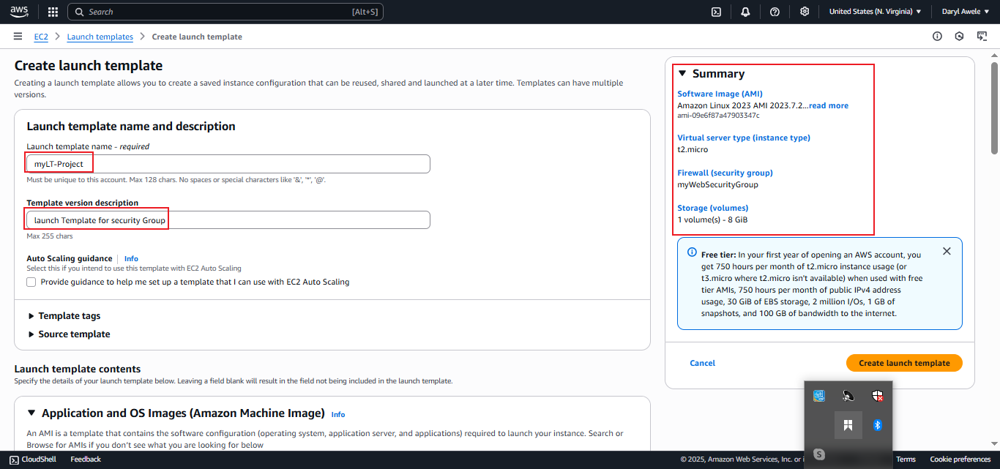
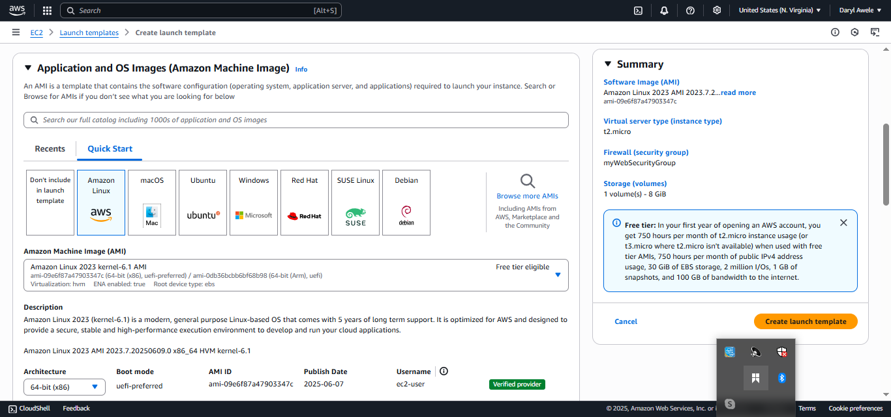
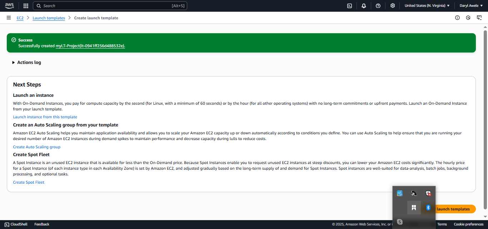
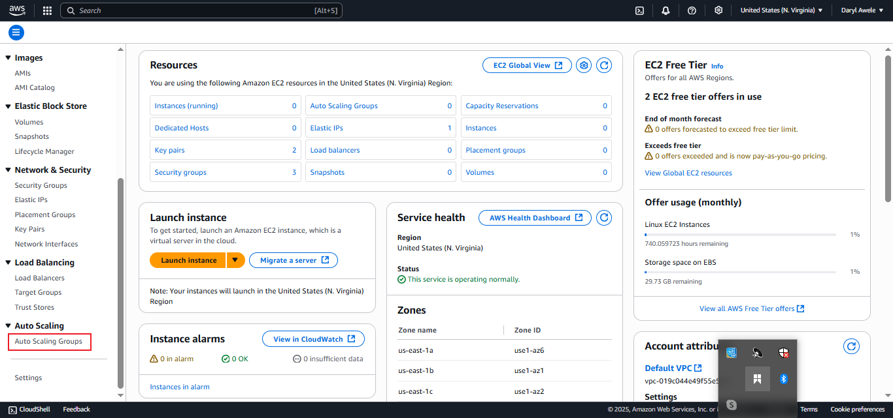
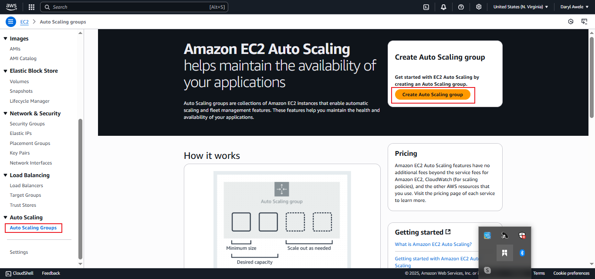

# Mini Project: Configuring Auto Scaling with ALB using Launch Template

In this mini project, you will learn how to configure Auto Scaling in AWS with an Application Load Balancer (ALB) using a Launch Template. The project aims to demonstrate the automatic scaling of EC2 instances based on demand, while leveraging the benefits of a Launch Template.

## Objectives:
### Create Launch Template:

- Learn how to create a Lauch Template with the required specifications

### Set Up Auto Scaling Group:

- Configure an Auto Scaling group to manage the desired number of EC2 instances using the Launch Template.

### Configure Scaling Policies:

- Set up scaling policies to adjust the number of instances based on demand.

### Attach ALB to Autoscaling Group: 

- Connect the Auto Scaling group to an existing ALB

### Test Auto Scaling:

- Verify that the Auto Scaling group adjusts the number of instances in response to changes in demand

## Create Launch Template

- Log in to the AWS Management Console


- Navigate to the EC2 service
- In the left panel, clcik on Lunch Template
- click create template


- Configure the Launch Template setting, include the AMI, Instance type, and user data



- Linux AMI Included



- t2.micro instance type and keypair added


- select security group
- click on create Launch Template


- LT Created successfully



## Setup Auto Scaling Group

- In the AWS console, navigate to the EC2




- Click on Auto Scaling Group (ASG)



- provide the ASG informations
- click next


- Choose and existing VPC and Subnets


-  ASG


- click next


- skip to review


- reviwe for errors


- review for error2


continue review


- Successfully created ASG


- Instance launched successfully


## Configure Scaling Policy

- In the Auto scaling group configuration, navigate to the "scaling policy section"


- click on create scaling policy
- click on next


- Configure policy for scaling in and out
- successfully created scaling policy


## Attch ALB to Auto Scaling Group

- in the auto scaling group, navigate to the Load Balancer
- create load balancer


- Select the ALB to associate with the Auto Scaling Group


- choose a load balancer name 


- network mapping, choose your VPC
- select your AZ ad subnet


- target group
- choose a target type
- click on next


- Load balanacer created successfully


- choose your load balance


- ASG updated successfully


## Test Auto Scaling
 - Generate traffic to trigger scaling policy
 - connect to EC2 instance and run this command.


 ``` bash 
         sudo amazon-linux-extras install epel -y
        sudo yum install stress -y

        stress -c 4 

```

- Monitor the auto scaling group and verify that the number of instances adjust based on demand.

- paste dns of application load balance on browser.


