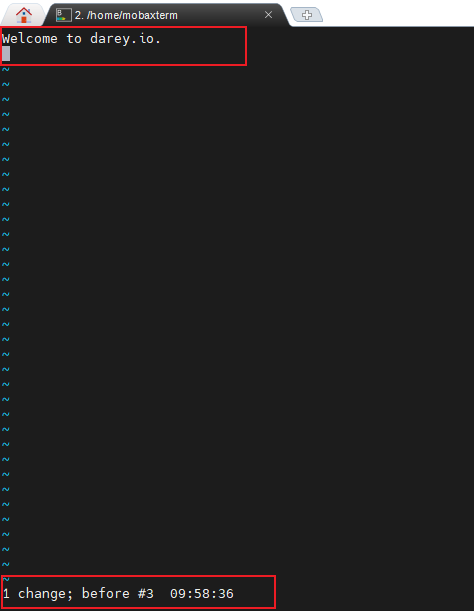

# Linux Text Editor
A linux Text Editor is a software application specifically designed for creating, modifying, and managing text files on Linux-base operating system.

Text editor plays a crucial role in the Linux environment, providing a means for users to interact and manipulate plain text files, configuration files, script and other text base documents.

There are various text editor available in the linux ecosystem, each with its own set of features and user interface.

## The use of some text editor.

### VIM Text Editor

The Linux Vim text editor, short for `vi improved`, is a powerful and versatile text editing tool deeply ingrained in the Unix and Linux ecosystem. While Vim have a steeper learning curve compared to simpler editor like `Nano`. it capabilities makes it a favorite among tech professionals and anyone working extensively with with text files.

### Working with Vim Editor

- *Open a new file* name `exercise.txt` using the following command.

- Enter `Insert Mood`, by clicking the `i` letter and type in the following content

### Moving Around
Navigate through the text by using the arrow keys or h(left), j(down), k(up), and l(right)

- The h key

- The j key

- The k key

- The l key

### Deleting a Character
Press `esc ` on your keyboard to exit the `insert mood`.

### Deleting a Line
To delete an entire line in the file, ensure that you are not on thr `instert mood`. If you are in the insert mood simply press the `esc` key as above.

### Undoing Changes
Make a change (add or delete text) in insert or normal mood, then press `esc` to get to normal mood.

- Press `u` to undo the last change

### Saving Changes
Afyer you have finished writing into the file, press `esc` then type **:wq!** and press enter. This will save the file `w` means write and `q` means quit which bassically quit the vim mood.

### Quitting without Saving
Incase you do not intend to save the file, simply press `esc`, then type **q!** and press enter to quit.

## Nano Text Editor
Among Linux text editors, Nano stands out as a user-friendly and straightforward tool, making it an excellent choice for users who are new to the command line or those who prefer a more intuitive editing experience.

### Work with Nano Editor

- Opening a Nano File name `nano_project.txt` 

### Entering and Editing Text

- Typing a few line of text to the nano text editor file

### Saving Changes

- Save your changes by pressing `ctrl` + `O`. Nano will prompt you to confirm the file name, press `Enter` to confirm.

### Exiting Nano

- If you wish to exit nano without saving the file, simply press `ctrl` + `X` 

### Opening an Exiting file

- Opening an exiting file (if available). Using the following command
`nano existing_file.txt`

