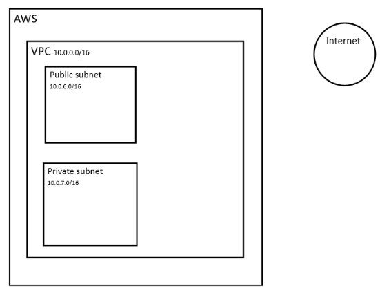
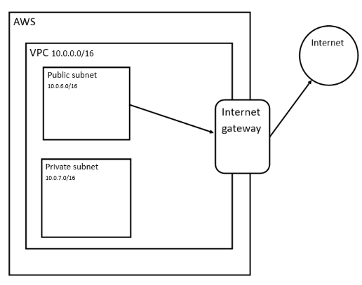
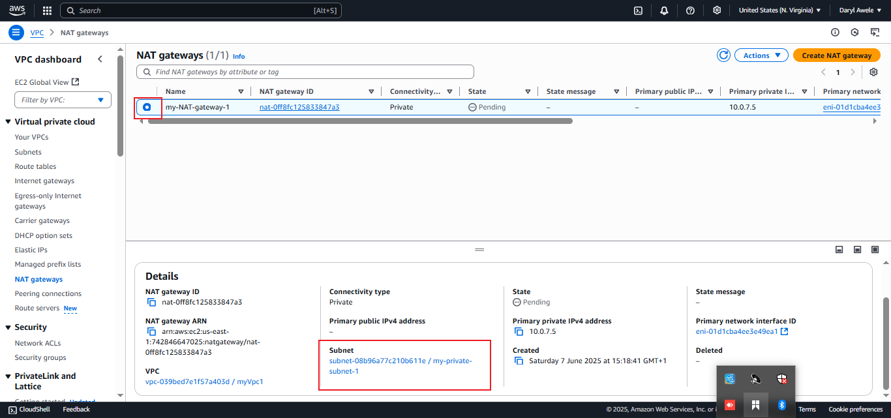
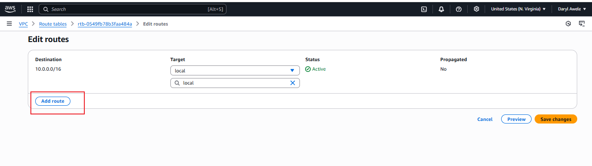
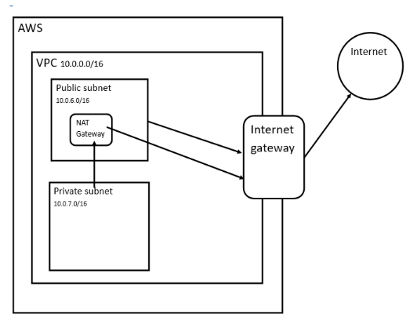
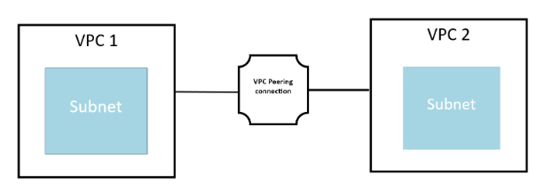
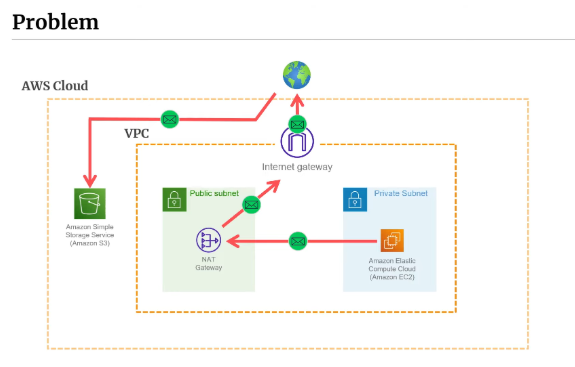
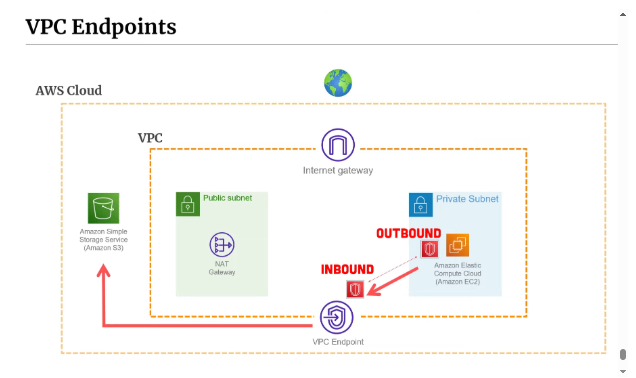

# Network Mastery with AWS Virtual Public Cloud (VPC)

## What is VPC, Subnets, Internet Gateway and NAT Gateway?

You can imagine you're building a virtual space for the company GatoGrowFast.com's so that the computers can communicate securely. That's what VPC, or Virtual Private Cloud, is all about. It's like creating a private room in the cloud just for GatoGrowFast.com's use.

`Here's an example:` Think of GatoGrowFast.com's office building. Inside, there are different departments like HR, Finance, and IT. Each department has its own area with specific access rules. Similarly, in a VPC, GatoGrowFast.com.con create different sections, called subnets, for different parts of the business. Now, let's say GatoGrowFast.com wants to connect its office to the internet. They'd use a router to control the flow of data in and out of the building. In a VPC, GatoGrowFast.com has something similar called an `Internet Gateway`. It lets their VPC communicate with the internet securely.

`NAT (Network Address Translation)` Gateway as a secret agent between GatoGrowFast.com's computers and the internet. When a computer inside their virtual office wants to talk to the internet, the NAT Gateway steps in. It translates the computer's message and sends it out, but it hides who sent it. It's like sending a letter without your return address. This way, the internet only sees the NAT Gateway's address, keeping GatoGrowFast.com's computers safe and anonymous online.

`Note-` A router is a device that directs data packets between computer networks. Think of it as a traffic cop for the internet. When data is sent from one device to another across a network, it's broken down into smaller packets. These packets need to find their way to the correct destination, and that's where the router comes in.

## What is an IP address?

An IP address is like a phone number for your computer. It's a unique set of numbers that helps computers find and talk to each other on a network, like the internet. There are two main types of IP addresses: **public IP addresses and private IP addresses**. However, each type has different versions, with IPv4 and IPv6 being the most common.

**Public IP Address:** This is like your home address. It's unique and helps other computers on the internet find yours. Just like how people send letters to your house using your address, data packets are sent to your computer using its public IP address.

A public IP address is globally unique and is assigned by the Internet Service Provider `(ISP)` to a device connected to the internet. It allows devices to communicate with other devices across the internet.

Public IP addresses can be either `dynamic` or `static`. Dynamic IPs change periodically, often each time a device reconnects to the internet, while static IPs remain constant. `Static IPs are typically used for servers, remote access, or services that require consistent connectivity`.

**Private IP Address:** Think of this like an internal extension number in a big office

building. It's used for communication within a specific network, like your home Wi-Fi network or an office network. Devices within the same network can talk to each other using their private IP addresses, but these addresses aren't visible to the outside world.

Private IP addresses are typically assigned by a router or a `DHCP (Dynamic Host Configuration Protocol)` server within the network. Devices within the same private network communicate with each other using their private IP addresses.

These addresses are not routable over the internet. They are used for internal network communication only and are hidden from the outside world. It is not globally unique and can be reused within different private networks without conflict.

### IPv4 Address:

IPv4 (Internet Protocol version 4) addresses are the most common type of IP addresses used today. They are 32-bit numeric addresses written in decimal format, separated by periods (e.g., 192.168.0.1).

IPv4 addresses are divided into five classes: A, B, C, D, and E, with classes A, B, and C being used for addressing hosts on networks. Each octet in an IPv4 address can have a value between 0 and 255. This is because each octet is made up of eight bits, and the maximum value that can be represented with eight bits is 255 (which is 11111111 in binary).

**IPv6 Address:**

IPv6 (Internet Protocol version 6) addresses are designed to replace IPv4 due to the exhaustion of available IPv4 addresses.

IPv6 addresses are 128-bit hexadecimal addresses, represented in eight groups of four hexadecimal digits separated by colons 
`(eg.. 2001:0db8:8503:0000:0000:802e:0370:7334)`.

IPv6 addresses provide a much larger address space compared to IPv4, allowing for a virtually unlimited number of unique addresses.


## What is CIDR?

CIDR, or Classless Inter-Domain Routing, makes it easier to talk about groups of IP addresses on the internet. Instead of naming each address one by one, CIDR uses a simple shortcut. It's like saying "All the houses on Main Street" instead of listing each house separately.

For example, let's say you have the IP address 192.168.1.0. With CIDR notation, you might write it like this: 192.168.1.0/24. The "/24" part tells us that we're talking about all the houses on that street from 192.168.1.0 to 192.168.1.255.

So. CIDR helps us manage and organize IP addresses on the internet in a way that's easy to understand and work with. It's like having a shorthand for talking about big groups of addresses. Determining the number of the available IP addresses in a CIDR to determine the number of IP addresses in CIDR block, you calculate it using the fomular:

``` bash
2^(32 - CIDR notation) - 2
```
The "-2" is for excluding the network address and the broadcast address.

### Example

Let's say we have a CIDR block of "192.168.1.0/24".

Using the formula, we calculate:

``` bash 
2^(32 - 24) - 2

=2^8 - 2

=256−2

=254
```


## What is a gateway?

Gateways are like doorways between different networks. They help data travel between your local network and other networks, like the internet. Just like a gate lets you go from your backyard to the neighborhood park, a gateway lets your data go from your computer to the internet and back again. It's like the traffic cop of the internet, directing your data where it needs to go.

For example - Imagine you live in a city with different neighborhoods, each with its own set of houses. You're in one neighborhood, let's call it Neighborhood A, and you want to visit a friend who lives in a different neighborhood, Neighborhood B. To get from your neighborhood to your friend's neighborhood, you need to go through a gateway-a special gate that connects the two neighborhoods. This gateway acts as a bridge between the two areas, allowing people and things to pass back and forth.
**The gateway helps you navigate from one neighborhood to another, just like how a network gateway helps data travel between different networks.**


## What is a Route table?

A route table is like a map that helps data find its way around a network. Just like a map shows you the best routes to get from one place to another, a route table tells devices on a network how to send data packets to their destinations.

In simpler terms, a route table lists different destinations and the paths (oroutes') to reach them. When a device receives data that it needs to send somewhere, it consult the route table to figure out where to send it.

For example, if your computer wants to send data to a website, it looks at its route table to find out which gateway to use to reach the internet. The route table might say, "To reach the internet, send data to the router." Then, the router knows how to forward the data to the next stop on its journey, eventually reaching its destination.

Think of a route table as the navigation system for data on a network, helping it find the fastest and most efficient paths to where it needs to go.

## Connection between Gateway and Route table

#### Gateways:

Gateways are devices (like routers or firewalls) that serve as entry and exit points between different networks. They connect networks with different IP address ranges, such as your local network and the internet.
Gateways receive incoming data packets and determine where to send them next based on routing information.

#### Route Tables:

Route tables are tables maintained by networking devices (like routers or switches) that contain information about how to route data packets to their destinations. Each entry in a route table specifies a destination network and the next hop (gateway) to reach that network.

Devices consult the route table to determine the best path for forwarding data packets based on their destination IP addresses.

#### Connection:

When a device (like a computer or server) wants to send data to a destination outside of its local network, it checks its route table.

The route table provides the information needed to determine the next hop (gateway) for reaching the destination network.

The device then forwards the data packet to the specified gateway, which continues the process until the packet reaches its final destination.

In summary, gateways and route tables work together to facilitate the routing of network traffic between different networks. Gateways serve as the entry and exit points between networks, while route tables provide the necessary routing information to determine how data packets should be forwarded to their destinations.

Now let's come to the practical part,

Steps -

1. Setting Up a Virtual Private Cloud (VPC)

2. Configuring Subnets within the VPC

3. Creating Internet Gateway and attaching it to VPC

4. Enabling Internet Connectivity with the Internet Gateway by setting up Routing tables

5. Enabling Outbound Internet Access through NAT Gateway

6. Establishing VPC Peering Connections.


# Part 1

- Navigate to the search bar and type VPC


- Click on you VPC


- Select the VPC only option
- Specify the IPv4 CIDR block 


- Click on create VPC


`Note-` If you encounter an error message stating that the CIDR block size must be between "/16" and "/28" when creating a VPC, it indicates that your provided CIDR block falls outside of this recommended range. Adjusting the CIDR block to fall within the specified range should resolve the issue.


- VPC successfully created


- This is the VPC we've created


# Part 2: Configurating the subnets within the VPC.

- Navigate to the subnet option
- Click on it to take you to the subnet page
- Create subnet


- Select the ID of the VPC we created in part 1


- Enter the subnet name and ID


- Choose the availability zone
- Specify the IPv4 subnet CIDR block
- Click on `Add new subnet`


- Repeat the same step for the second subnet
- Choose the availability zone
 - IPv4 subnet CIDR block
 - Create subnet

 


 - Diagram illustrating VPC and the 2 subnets

 

 - Subnets successfully created

 


 # Part 3

 - Navigate to the internet gateway option
 - Click on create internet gateway

 


 - Specify the name of the gateway
 - Click create internet gateway

 


 - Gateway successfully created

 


 #### Now, you will notice that it is currently detached, indicating that it is not associated with any VPC. To enable internet connectivity, you must attach the Internet Gateway to the VPC you have previously created.

 

 - Click on action, and click on attach the vpc

 

 - enter the vpc ID we created
 - Click on attach to VPC

 


 - Successfully attached to VPC

 

 #### Now lwt's come to the next part which is Enably Internet Connectivity with the Internet Gateway by setting up Routin .

 # Part 4

- Proceed to the Route Table
- Click on Create Route Table


- Enter the name of the Route Table
- Select the VPC you created previously
- Click on the create Route Table 


Next, click on "Subnet association" followed by "Edit subnet association" to associate the subnet with the route table.


- Choose the public subnet
- Click on save association 


- Navigate to routes 
- Click Edit routes


- Click on add Route


- Select "Destination" as "0.0.0.0/0" indicating that every IPv4 address can access the subnet
 - In the "Target field" choose "Internet Gateway" 
 - Select the Internet Gateway you created 
 - save the change


`The route table has now been configured to route traffic to the Internet Gateway, allowing connectivity to the Internet. Since only the subnet named "my-public-subnet-1" is associated with this route table, only resources within that subnet can access the internet.`


Diagram illustrating the Internet Gateway connected to the public subnet



`Now, let's come to the next part which is Enabling Outbound Internet Access through NAT Gateway, (by attaching NAT Gateway to the subnet and attaching the route table.)`


# Part 5

- Navigate to the NAT Gateway
- Create NAT Gateway


- Mention the name of the NAT Gateway
- Choose Private subnet
- Connectivity type "private"


- Create NAT Gateway


- NAT Gateway created successfully


- Select the NAT Gateway 
- Navigate to "Detail tab"
- Locate the subnet ID and click on it



- In the subnet page, navigate to the Route Table section
- Click on Route Table ID


- Proceed to the Route and click on it
- Edit routes


- Click on Add Routes



- Select Destination as 0.0.0.0/0
- In the Target field, choose NAT Gateway
- Select the NAT Gateway you created
- Sve change


- On the subnet association section
- Click on edit subnet association


- Choose the private subnet
- Save association


`The subnet has been successfully attached with the route table.`


Diagram showing NAT Gateway connected




# Difference between Internet Gateway and NAT Gateway

### Internet Gateway:

Think of it like a door to the internet for your subnet. When you attach an Internet Gateway to a subnet, it allows the resources in that subnet (like EC2 instances) to reach out to the internet and also allows internet traffic to reach those resources. It's like having a door both to enter and exit the subnet.

### NAT Gateway:

Imagine it as a one-way street sign for your subnet's traffic. When you attach a NAT Gateway to a subnet, it lets the resources in that subnet (like EC2 instances) access the internet, but it doesn't allow incoming traffic from the internet to reach those resources. It's like the resources can go out to the internet, but the internet traffic can't directly come in.

Now, let's proceed further and come to our next part that involves Establishing VPC Peering Connections. For this let's first understand some terms-

**Note-** An EC2 instance is a virtual server in AWS that you can use to run applications. It offers flexible computing power and can be easily scaled up or down. EC2 instances are widely used for hosting websites, running software, and processing data in the cloud

### What is VPC Peering?

VPC peering is like connecting two virtual offices in the cloud so they can talk to each other directly. Just imagine two neighboring offices sharing files and chatting without going through a middleman.

- By default, EC2 instances in different VPCs cannot communicate with each other.

- To enable communication between EC2 instances in different VPCs, you can set up VPC peering, VPN connections, or AWS Direct Connect.

- VPC peering establishes a direct network connection between the VPCs, allowing EC2 instances in one VPC to communicate with EC2 instances in the other VPC.

## Why do we need VPC Peering?

We need VPC peering when we want different parts of our cloud network (VPCs) to work together smoothly. Maybe you have one VPC for your development team and another for your marketina team and vou want them to share data securely. That's where VPC peering comes in handy-it lets these VPCs communicate directly, making things easier for everyone.

Additionally, there are some key points that you should be aware of.

- Two VPCs cannot connect to each other. You need to set up VPC peering or use a VPN or Direct Connect to establish connectivity between VPCs.

- Subnets within the same VPC can communicate with each other by default. AWS sets up route tables to allow communication within the same VPC.

- EC2 instances in the same subnet can communicate with each other by default, assuming they have proper security group rules allowing the desired traffic.

- EC2 instances in different subnets within the same VPC can also communicate with each other by default, as long as their associated route tables are configured to allow traffic among subnets.

# Part 6

- Create two VPCs in the same region
- Requester VPC and 
- Accepter VPC 


- Requester VPC Created


- Accepter VPC 


- Click to creater Accepter VPC


- Requester and Accepter VPC created successfully


- Navigate to the Peering Connections option
- Click on peering connection button


Now, provide a name for the VPC peering connection.

- select the requester VPC.

- Choose the account "My account" since the VPCs are in our own AWS account.


- Ensure to use the same region, This Region (ap-southeast-1)," as the VPCs were created in the same region.

- Next, select the accepter VPC

- proceed by clicking on the "Create Peering Connection button.


- Peering has been requested


- In the peering location page 
- Locate the Action option on the right


- Click on accept request


- Click on Main Route Table ID of the accepted VPC


- Choose the route table
- Navigate to Routes section
- Click on Edir route


- Click on add route


7. Go to the VPC page

- select the requester VPC


- In the details tab, you'll find the IPv4 CIDR. (in this case-192.168.0.0/16)


- edit route


- Copy this CIDR and paste it in the "Destination" field when adding a route.

- In the target, choose VPC peering and choose the peering connection you have created. 

- save changes


- Successfully updated


- Diagram illustration of VPC peering




# VPC endPoint
Think of a VPC endpoint like a dedicated, secure tunnel between your house (VPC) and a library (AWS service). Instead of going through the bustling streets (public internet), you have a direct pathway from your home to the library. This pathway ensures that only you and authorized users can access the library's resources, like books or documents, without exposing them to outside risks. It's a private, efficient way to access what you need, keeping your data safe from prying eyes on the internet.

Let's understand the problem we were facing

When you're backing up data from an EC2 instance to an S3 bucket, it usually goes over the internet, whether the instance is in a public or private subnet. But if the data is sensitive, that means it's risky because hackers could try to get it while it's traveling over the internet.

# Problem




To avoid this risk, we can use something called VPC endpoints. These endpoints make a private connection between the VPC and S3, so the data doesn't have to go over the internet. This way, even sensitive data stays safe from hackers and other threats.

# VPC Endpoint


